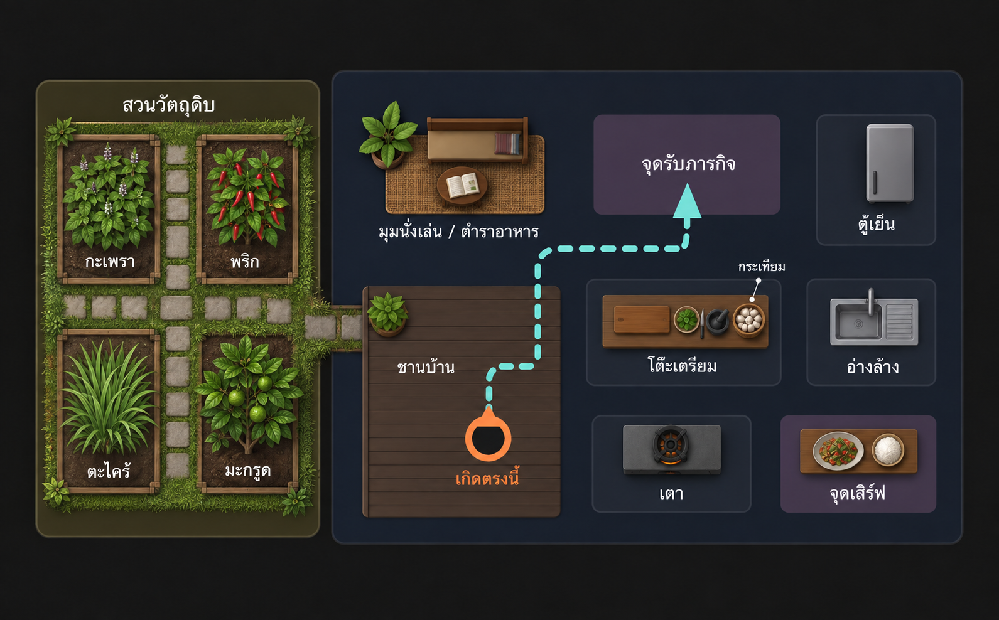

# Cookverse Thai — แผนผังบ้านและสวนวัตถุดิบ

อัปเดต: 18 กันยายน 2026  
สถานะ: แบบร่างสำหรับทำ Blockout ยังไม่ใช่ขนาดสุดท้ายและยังไม่ได้สร้างลง `MainVR.unity`



## แนวทางภาพรวม

- บ้านเป็นเรือนไทยขนาดเล็กในชนบท ผสมอุปกรณ์ครัวทรงโมเดิร์น
- ตัดห้องนอนแบบห้องปิดออก
- ใช้พื้นที่เดิมเป็นมุมนั่งเล่นและตำราอาหารแบบเปิด
- ผู้เล่นเกิดบนชานบ้านและหันไปเห็นจุดรับภารกิจ
- ทางเดินจากจุดเกิดไปจุดรับภารกิจต้องไม่ตัดผ่านโต๊ะหรืออุปกรณ์
- สวนอยู่ข้างบ้านและมีทางเดินเชื่อมชานบ้านโดยตรง
- แบบร่างนี้ใช้กำหนดตำแหน่งก่อน รายละเอียดหลังคา วัสดุ และของตกแต่งทำภายหลัง

## พื้นที่ภายในบ้าน

1. ชานบ้านและจุดเกิดผู้เล่น
2. มุมนั่งเล่น / ตำราอาหาร
3. จุดรับภารกิจ
4. ตู้เย็น
5. โต๊ะเตรียมและเขียง
6. ตะกร้ากระเทียมบริเวณโต๊ะเตรียม
7. อ่างล้าง
8. เตา
9. จุดเสิร์ฟ

## สวนวัตถุดิบ

สวนแบ่งเป็นสี่ส่วนเพื่อให้แยกชนิดพืชได้ง่ายใน VR:

| พืช | บทบาทในรอบแรก | การโต้ตอบ |
|---|---|---|
| กะเพรา | วัตถุดิบหลักของผัดกะเพรา | หยิบได้และเชื่อมภารกิจ |
| พริก | วัตถุดิบของผัดกะเพรา | หยิบได้และเชื่อมภารกิจ |
| ตะไคร้ | สร้างบรรยากาศสวนครัวไทยและรองรับเมนูในอนาคต | ฉากประกอบก่อน |
| มะกรูด | เพิ่มรูปทรงต้นไม้และรองรับเมนูในอนาคต | ฉากประกอบก่อน |

กระเทียมเก็บในตะกร้าภายในครัว ไม่ปลูกเป็นแปลงในสวนสำหรับต้นแบบนี้

## ลำดับการเล่นที่ผังต้องรองรับ

```text
เกิดบนชานบ้าน
→ รับภารกิจ
→ เดินเข้าสวน
→ เก็บกะเพราและพริก
→ กลับเข้าครัว
→ หยิบวัตถุดิบจากตู้เย็น
→ ล้าง
→ เตรียมและหั่น
→ ปรุง
→ จัดจานและเสิร์ฟ
```

## การแบ่งงาน

### Mac M5

- สร้างบ้าน ชาน หลังคา ทางเดิน และแปลงสวนแบบ Blockout ใน `MainVR.unity`
- ทำ `Garden_Blockout` เป็นกลุ่มหรือ Prefab ที่ย้ายทั้งชุดได้
- สร้างรูปทรงพืชทั้งสี่ชนิดแบบง่ายและวางป้ายชั่วคราว
- เว้นทางเดินหลักประมาณ 1.2–1.5 เมตรสำหรับทดสอบ VR
- ตรวจตำแหน่งจุดเกิด จุดรับภารกิจ และสถานีครัวใน XR Interaction Simulator

### Mac M1

- ทำ Prefab กะเพราและพริกที่หยิบได้
- กำหนด `ingredientId` และเชื่อมกับ Objective/Collection System
- ทำกฎตรวจชนิด จำนวน ลำดับ และป้องกันการนับชิ้นเดิมซ้ำ
- ตะไคร้และมะกรูดยังไม่ต้องมีระบบโต้ตอบในรอบแรก

หาก M1 รับงานไม่ไหว M5 สามารถช่วยสร้าง Prefab หรือระบบโต้ตอบได้ แต่ต้องใช้ `ingredientId`, Event และกฎข้อมูลชุดเดียวกับ M1 ก่อนรวมงาน

## โครงสร้างที่แนะนำใน Unity

```text
Environment
├── ThaiHut_Blockout
│   ├── Porch
│   ├── OpenLivingRecipeCorner
│   ├── KitchenStations
│   └── Roof_Blockout
├── Garden_Blockout
│   ├── KrapowArea
│   ├── ChiliArea
│   ├── LemongrassArea
│   └── KaffirLimeArea
└── GardenPath_Blockout

GameplaySystems
├── QuestStart
├── ObjectiveManager
├── IngredientManager
└── ServeZone
```

## จุดที่ต้องตรวจบน Quest 3

- จุดเกิดไม่อยู่ใน Collider หรือชิดโต๊ะ
- ผู้เล่นเห็นจุดรับภารกิจทันทีเมื่อเริ่ม
- ทางเดินกลางไม่แคบและไม่ถูกโต๊ะเตรียมขวาง
- เดินจากชานบ้านไปสวนและกลับครัวได้สะดวก
- ก้มเก็บวัตถุดิบได้โดยไม่ต้องก้มต่ำเกินไป
- ระยะเอื้อมตู้เย็น อ่าง โต๊ะ เตา และจุดเสิร์ฟเหมาะสม
- ป้ายชื่อและ UI อ่านได้จากระยะใช้งานจริง

ตำแหน่งและขนาดในภาพเป็นแนวทางเท่านั้น ต้องปรับหลังทดสอบ Quest 3 จริง ห้ามถือว่าผังนี้ผ่านการทดสอบ VR แล้ว
